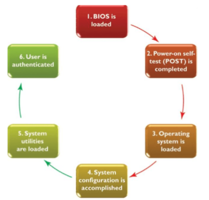
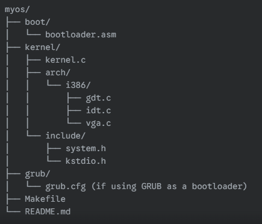

# OS Project Guide: Building a Mini-OS from Scratch

## PROJECT OVERVIEW [cite: 1]

Instead of aiming for a full-fledged OS like Windows or Linux, we're going to build a very stripped-down version[cite: 2]. Think of it as the bare minimum software needed to get the computer to a usable (albeit very basic) state[cite: 3]. This might initially just involve the kernel loading, initializing some basic hardware, and perhaps displaying some text on the screen[cite: 4]. As we progress, we might try to add very simple features like basic memory management or rudimentary input handling[cite: 5]. The key is to start small and build incrementally[cite: 6].

## PROJECT GOAL AND AIMS

### Specific Aims & Deliverables

* **Bootloader Implementation:** [cite: 7]
    * Aim: Create a multi-stage bootloader capable of loading your C kernel into memory[cite: 7].
    * Deliverable: A functional bootloader (written primarily in Assembly) that can read a kernel from disk (e.g., floppy/CD image) and transfer control to its C entry point[cite: 8].
* **CPU Mode Transition:** [cite: 9]
    * Aim: Successfully transition the CPU from Real Mode to 32-bit Protected Mode (and potentially 64-bit Long Mode if ambitious)[cite: 9].
    * Deliverable: Your C kernel successfully begins execution in Protected Mode, with a correctly configured Global Descriptor Table (GDT) for memory segmentation[cite: 10].
* **Basic Kernel Entry & Output:** [cite: 11]
    * Aim: Execute your C kernel's main function and display output directly to the screen[cite: 11].
    * Deliverable: Your C kernel successfully starts and prints a "Hello, OS!" message directly to VGA text mode memory[cite: 12].
* **Interrupt Handling & Keyboard Input:** [cite: 13]
    * Aim: Implement basic interrupt handling to respond to hardware events like timer ticks and keyboard presses[cite: 13].
    * Deliverable: A functional Interrupt Descriptor Table (IDT) that can handle timer interrupts and PS/2 keyboard input, successfully capturing and printing typed characters to the screen[cite: 14]. This involves proper PIC (Programmable Interrupt Controller) setup[cite: 15].
* **Kernel Utilities (Basic):**
    * Aim: Develop fundamental C functions that a basic OS kernel needs without relying on a standard C library[cite: 16].
    * Deliverable: Your own implementations of functions like printf-style output, string manipulation (strlen, strcpy, memcpy, memset), and potentially a very simple physical memory allocator (e.g., a bump allocator) written in C[cite: 16].
* **Robust Toolchain & Workflow:**
    * Aim: Establish a repeatable and efficient development and debugging workflow[cite: 17].
    * Deliverable: A functional build system (Makefile) that orchestrates Assembly and C compilation/linking into a single bootable image, and demonstrated proficiency in using QEMU and GDB for testing and debugging your low-level code[cite: 17].

## TEAM DIVISION [cite: 18]

* **Team Lead/Coordinator (1 person):** Responsible for overall project planning, task assignment, progress tracking, and ensuring team communication and integration[cite: 18].
* **Architecture & Bootloader Team (2-3 people):** Focus on in-depth understanding of the target architecture, designing the initial memory layout, and developing the bootloader in assembly language[cite: 19].
* **Kernel Core Team (3-4 people):** Focus on the fundamental kernel structure, basic C setup within the kernel, implementing essential services like a basic memory allocator, and potentially a very simple scheduler[cite: 20].
* **Basic I/O & Display Team (2-3 people):** Focus on enabling basic output to the screen (text mode initially), and potentially handling simple input (keyboard)[cite: 21].
* **Documentation & Testing Team (1-2 people):** Focus on documenting the design decisions, code structure, and writing basic tests for the different components as they are developed[cite: 22].

## ROADMAP [cite: 23]

### Month 1: Foundational Knowledge & Team Specialization [cite: 23]

* **Week 1-2: Individual Learning & Core Concepts (All Members):**
    * Everyone should go through the fundamental concepts: computer architecture, basic assembly, memory organization, and the boot process (using resources like OSDev Wiki)[cite: 23].
    * Initial discussions as a team to decide on the target architecture (stick with 32-bit x86 for simplicity initially)[cite: 24].
    * Team Lead starts defining the high-level architecture and breaking down the project into major components[cite: 25].
* **Week 3-4: Team Specialization & Initial Prototyping:** [cite: 26]
    * Based on individual progress and interests, form the sub-teams outlined above[cite: 26].
    * **Architecture & Bootloader Team:** Deep dive into the chosen architecture's boot process and start prototyping the initial bootloader in assembly[cite: 27]. Focus on getting the system to a point where it can load a small program into memory[cite: 28].
    * **Kernel Core Team:** Focus on setting up the cross-compilation environment and start experimenting with a minimal C kernel entry point[cite: 29]. Begin researching basic memory management concepts in the kernel[cite: 30].
    * **Basic I/O & Display Team:** Research how to interact with the video display in text mode for the chosen architecture[cite: 31]. Start experimenting with simple output in assembly (potentially as part of the bootloader phase)[cite: 31].
    * **Documentation & Testing Team:** Start documenting the team structure, initial design decisions, and setting up a basic system for tracking progress and potential issues[cite: 32].

### Month 2: Core Kernel Development & Inter-Team Integration [cite: 33]

* **Week 5-6: Bootloader Refinement & Kernel Initialization:** [cite: 33]
    * **Architecture & Bootloader Team:** Refine the bootloader to reliably load the kernel into memory[cite: 33]. Establish the basic memory layout for the kernel[cite: 34].
    * **Kernel Core Team:** Focus on essential kernel initialization tasks (setting up a basic stack, potentially initializing a simple memory allocator)[cite: 34]. Start defining interfaces for basic kernel services[cite: 35].
    * **Basic I/O & Display Team:** Work on getting the kernel to print basic text to the screen[cite: 36].
    * **Documentation & Testing Team:** Document the bootloader and initial kernel setup[cite: 36]. Write basic tests to ensure the bootloader loads the kernel correctly[cite: 37].
* **Week 7-8: Basic Memory Management & Inter-Process Communication (Conceptual):** [cite: 38]
    * **Kernel Core Team:** Implement a very basic memory allocator (e.g., a simple fixed-size block allocator or a first-fit algorithm using linked lists)[cite: 38].
    * **Architecture & Bootloader Team:** Ensure the bootloader can provide necessary information to the kernel (e.g., memory map)[cite: 39].
    * **Basic I/O & Display Team:** Potentially explore basic keyboard input if time allows, or further refine screen output[cite: 40].
    * **Documentation & Testing Team:** Document the memory management implementation and write tests for allocation and deallocation[cite: 41]. Begin conceptual discussions on how basic "processes" might interact (even if not fully implemented yet)[cite: 42].

### Month 3: Expanding Functionality & System Integration [cite: 43]

* **Week 9-10: Simple Scheduling & Interrupt Handling (Introduction):** [cite: 43]
    * **Kernel Core Team:** Design and implement a very basic scheduler (e.g., round-robin between a few "kernel threads" or simple functions)[cite: 44]. Begin exploring basic interrupt handling mechanisms (timer interrupt as a starting point)[cite: 44].
    * **Basic I/O & Display Team:** Integrate keyboard input with the kernel if not done earlier[cite: 45]. Explore more advanced text mode features or basic graphics concepts (if ambitious)[cite: 46].
    * **Architecture & Bootloader Team:** Ensure the system can handle the transition to the kernel and potentially set up basic interrupt handling in the hardware[cite: 47].
    * **Documentation & Testing Team:** Document the scheduling and interrupt handling mechanisms[cite: 48]. Write tests to verify their basic functionality[cite: 48].
* **Week 11-12: Integration, Refinement, and Demonstration:** [cite: 49]
    * Focus on integrating all the developed components into a cohesive mini-OS[cite: 49].
    * Extensive testing and debugging as a team[cite: 50].
    * Refine the existing functionality and improve stability[cite: 51].
    * Prepare a demonstration of what the team has achieved[cite: 51].
    * Documentation team focuses on creating an overall project summary and potential future steps[cite: 51].

## OUR LEARNING CURVE [cite: 52]

### Phase 1: Bootstrapping & Real Mode (Weeks 1-2) [cite: 52]

* **Goal:** Get your machine to boot your code, understand the initial CPU state, and make simple outputs in Real Mode[cite: 52].
* **Computer Architecture & Organization (CAO):** [cite: 53]
    * CPU Boot Process: BIOS, POST, MBR (Master Boot Record), Boot Sector, IPL (Initial Program Loader)[cite: 53].
    * Real Mode: 16-bit CPU operation, segment:offset addressing, 1MB memory limit, A20 line (and why it matters)[cite: 54].
    * CPU Registers: General-purpose registers (AX, BX, CX, DX, etc.), Segment registers (CS, DS, ES, SS), Instruction Pointer (IP), Flags register[cite: 55].
    * Memory Map (Basic): Understanding where BIOS, VGA text buffer, and your bootloader are loaded in memory[cite: 56].
* **Operating Systems (OS):** [cite: 57]
    * Role of Bootloader: Its purpose, limitations (512 bytes), and the first stage of OS loading[cite: 57].
    * BIOS Interrupts (INT): How the bootloader uses BIOS services (e.g., INT 10h for video, INT 13h for disk reads)[cite: 58].
* **Assembly Language:** [cite: 59]
    * Basic x86 Instructions: MOV, JMP, CALL, RET, INT, PUSHA/POPA, CLI/STI[cite: 59].
    * Addressing Modes: Immediate, Register, Direct, Register Indirect[cite: 60].
    * Stack: PUSH, POP, SP/BP registers[cite: 60].
    * Segment Overrides: CS:, DS:[cite: 60].
    * BIOS Calls: Correctly passing arguments to BIOS interrupts[cite: 61].
* **C Language:** [cite: 62]
    * (Minimal in this phase): Understanding how assembly will eventually jump to a C function[cite: 62].
* **Cross-Compiler:** [cite: 63]
    * Concept: What a cross-compiler is and why it's needed for bare-metal development (compiling for a target architecture/environment different from your host)[cite: 62].
    * Basic Toolchain: nasm (assembler), gcc (compiler), ld (linker)[cite: 63].
* **Virtual Machines (VM/QEMU):** [cite: 64]
    * QEMU Basics: How to launch QEMU with your bootable image (e.g., qemu-system-i386 -fda your_os.bin)[cite: 64].
    * Debugging with QEMU: Basic QEMU flags for debugging (e.g., -s, -S)[cite: 64].
* **Data Structures & Algorithms (DSA):** [cite: 65]
    * (Minimal in this phase): No explicit DSA concepts[cite: 65].

### Phase 2: Protected Mode & Kernel Entry (Weeks 3-4) [cite: 66]

* **Goal:** Transition the CPU from 16-bit Real Mode to 32-bit Protected Mode and execute your first C kernel code[cite: 66].
* **CAO:** [cite: 67]
    * Protected Mode: 32-bit addressing, flat memory model, privilege levels (rings)[cite: 67].
    * Global Descriptor Table (GDT): Its structure (descriptors for code/data segments), role in Protected Mode segmentation, loading the GDT register (LGDT)[cite: 68].
    * A20 Line: Its role in enabling access to memory above 1MB[cite: 69].
* **OS:** [cite: 70]
    * Kernel Definition: What a kernel is and its initial responsibilities[cite: 70].
    * Memory Management (Conceptual): Understanding why Protected Mode is needed for larger memory access[cite: 71].
* **Assembly Language:** [cite: 72]
    * Protected Mode Enablement: Instructions to switch CPU mode (e.g., setting PE bit in CR0)[cite: 72].
    * GDT Setup: Defining GDT entries and loading the GDTR[cite: 73].
    * Inter-segment Jumps: Far jumps for code segment reloading in Protected Mode[cite: 74].
    * Calling C from Assembly: Setting up the stack for C function calls (calling conventions)[cite: 75].
* **C Language:** [cite: 76]
    * Bare-metal C: Writing C code that runs without a standard library (e.g., main function)[cite: 76].
    * `volatile` keyword: Understanding its use for hardware registers to prevent compiler optimizations[cite: 77].
    * Pointers (Advanced): Using pointers to directly access memory addresses (e.g., VGA buffer)[cite: 78].
    * Linker Scripts: Writing a basic linker script (.ld) to define memory sections for your kernel[cite: 79].
* **Cross-Compiler:** [cite: 80]
    * Toolchain Usage: Compiling C code (gcc) for the target, linking (ld) with assembly[cite: 80].
* **VM/QEMU:** [cite: 81]
    * QEMU Debugging with GDB: Connecting GDB to QEMU to step through both assembly and C code[cite: 81].
    * Learning GDB commands (b, s, n, c, info reg, x/i $pc, layout asm, layout reg, layout src)[cite: 82].

### Phase 3: Basic I/O & Interrupts (Weeks 5-7) [cite: 83]

* **Goal:** Implement basic output (VGA text mode) and input (keyboard), driven by hardware interrupts[cite: 83].
* **CAO:** [cite: 84]
    * Interrupts: Hardware interrupts (IRQs) vs. Software interrupts, interrupt controller (PIC - Programmable Interrupt Controller)[cite: 84].
    * Interrupt Descriptor Table (IDT): Structure of IDT entries, Interrupt Gates, Trap Gates. Loading the IDT register (LIDT)[cite: 85].
    * I/O Ports: Accessing hardware registers via `in` and `out` instructions[cite: 86].
    * PIC Operation: Masking/unmasking IRQs, End-of-Interrupt (EOI) signal[cite: 86].
* **OS:** [cite: 87]
    * Interrupt Handling: How the OS responds to hardware events[cite: 87].
    * Interrupt Service Routines (ISRs): The code that executes when an interrupt occurs[cite: 88].
    * Device Drivers (Basic): VGA text mode driver, PS/2 Keyboard driver[cite: 89].
    * Kernel Printing: Implementing a printf-like function without a standard library[cite: 90].
* **Assembly Language:** [cite: 91]
    * ISR Stubs: Writing short assembly routines to save context (registers), call the C interrupt handler, and restore context[cite: 91].
    * I/O Port Instructions: `IN` and `OUT` for communicating with PIC and keyboard controller[cite: 92].
* **C Language:** [cite: 93]
    * Function Pointers: For setting up interrupt handlers in the IDT[cite: 93].
    * Structs and Bitfields: For defining hardware registers or IDT entries[cite: 94].
    * `static` functions: For internal kernel utilities[cite: 94].
    * Global variables: For kernel state[cite: 95].
* **Cross-Compiler:** [cite: 96]
    * Inline Assembly: Using `asm volatile` in C for direct `in`/`out` instructions or other low-level CPU operations[cite: 96].
* **VM/QEMU:** [cite: 97]
    * Debugging Interrupts: Using GDB to set breakpoints in ISRs, inspect interrupt frames[cite: 97].
* **DSA:** [cite: 98]
    * Arrays: For the VGA text buffer, and potentially a basic keyboard buffer[cite: 98].

### Phase 4: Kernel Services & Modularity (Weeks 8-10) [cite: 99]

* **Goal:** Enhance kernel functionality, improve code organization[cite: 99].
* **CAO:** [cite: 99]
    * Basic Memory Allocation: Understanding heap vs. stack, physical vs. virtual memory (conceptual, no paging yet)[cite: 99].
    * Timer Hardware: Understanding basic timer concepts and its use for scheduling (conceptual)[cite: 100].
* **OS:** [cite: 101]
    * Kernel Libraries: Building reusable modules (e.g., string library, basic math functions)[cite: 101].
    * Memory Management (Basic): Implementing a simple heap allocator (malloc/free equivalent)[cite: 102].
    * Scheduler (Conceptual): How a timer interrupt can be used to switch between tasks (conceptual or very basic, non-preemptive)[cite: 103].
    * Basic Shell/Command Line Interpreter: Reading input, parsing commands, executing functions[cite: 104].
* **Assembly Language:** [cite: 105]
    * (Minimal in this phase): Primarily for specific low-level tasks[cite: 105].
* **C Language:** [cite: 106]
    * More Complex Data Structures: Linked lists (for free memory blocks in a heap allocator), arrays, potentially function tables for syscalls (conceptual)[cite: 106].
    * Modular Programming: Structuring C code into .h (headers) and .c files for better organization[cite: 107].
* **Cross-Compiler:** [cite: 108]
    * Makefile Automation: Improving the Makefile to handle multiple source files, libraries, and build targets[cite: 108].
* **VM/QEMU:** [cite: 109]
    * QEMU Advanced Features: Emulating specific hardware, networking (if ambitious)[cite: 109].
* **DSA:** [cite: 110]
    * Linked Lists: For a simple free-list memory allocator[cite: 110].
    * Queues/Buffers: For keyboard input buffering[cite: 111].
    * Basic String Algorithms: For shell parsing (strcmp, strtok equivalents)[cite: 111].

## RESOURCES [cite: 112]

* **Operating Systems (OS):**
    * [https://wiki.osdev.org/](https://wiki.osdev.org/) [cite: 112]
    * [https://pages.cs.wisc.edu/~remzi/OSTEP/](https://pages.cs.wisc.edu/~remzi/OSTEP/) [cite: 112]
* **C Programming:**
    * [https://www.learn-c.org/](https://www.learn-c.org/) [cite: 112]
    * [https://www.geeksforgeeks.org/c-programming-language/](https://www.geeksforgeeks.org/c-programming-language/) [cite: 112]
* **x86 Assembly Language:**
    * [https://www.nasm.us/doc/](https://www.nasm.us/doc/) [cite: 112]
    * [https://www.intel.com/content/www/us/en/developer/articles/technical/intel-sdm.html](https://www.intel.com/content/www/us/en/developer/articles/technical/intel-sdm.html) [cite: 112]
* **Computer Architecture & Organization (CAO):**
    * [https://www.geeksforgeeks.com/computer-organization-and-architecture-tutorials/](https://www.geeksforgeeks.com/computer-organization-and-architecture-tutorials/) [cite: 112]